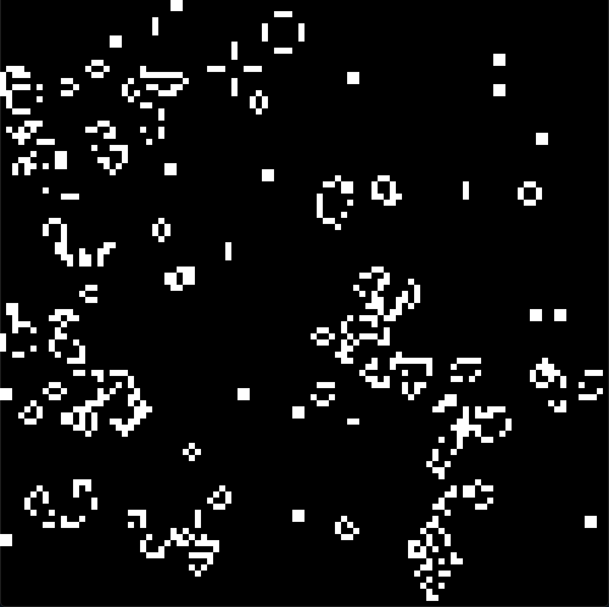

# Conways Game of Life

> See here for a quick write up of the project: https://mefchristiansen.github.io/projects/conways-game-of-life/

 

[Conway's Game of Life](https://en.wikipedia.org/wiki/Conway%27s_Game_of_Life) written in Go

I also enabled the user to be able to interact with the board by being able to set the state of a cell and its neighboring cells to alive when left clicking the cell. This allows for some really interesting results.

## Installation

`go install`

## Run

`go run main.go`
